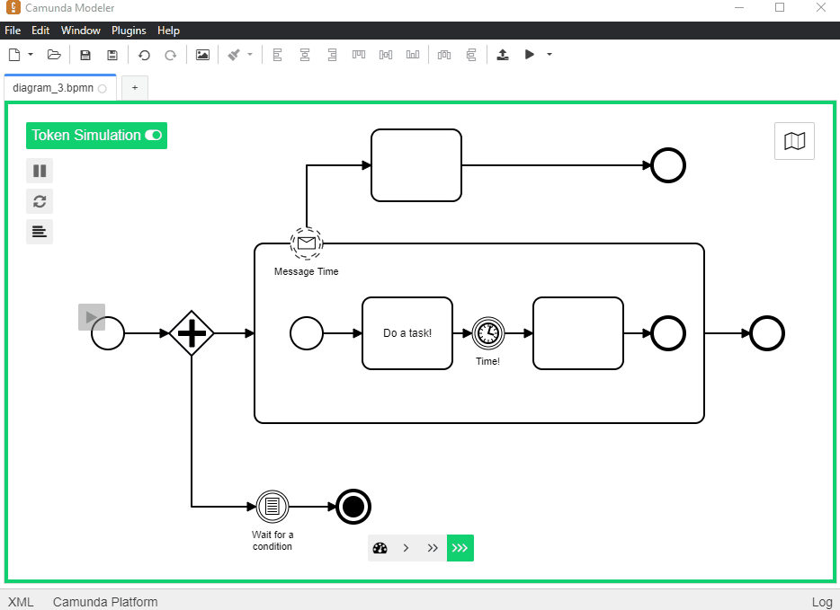
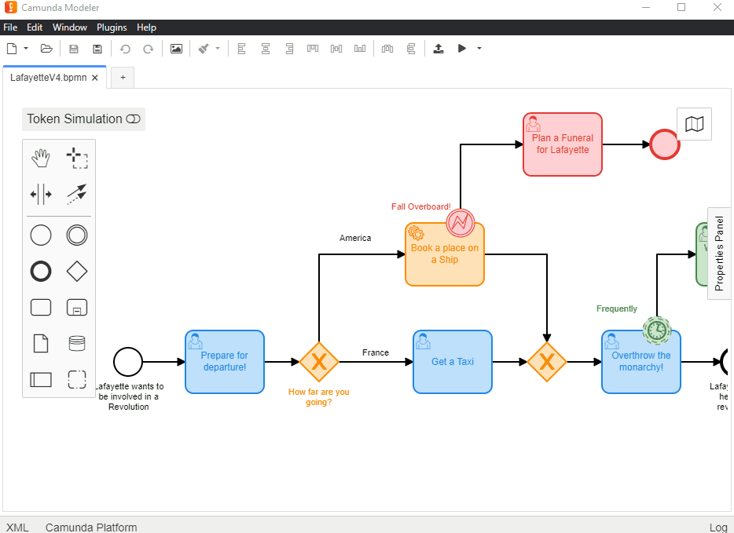
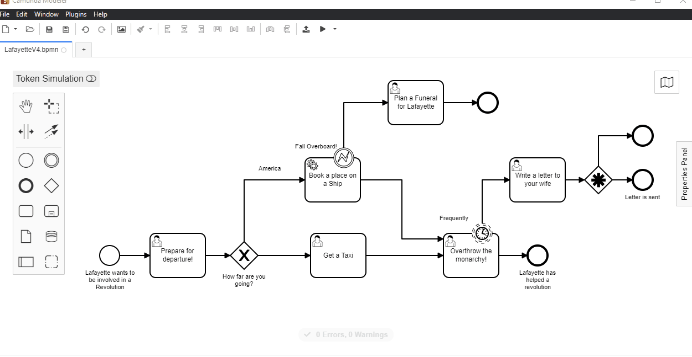
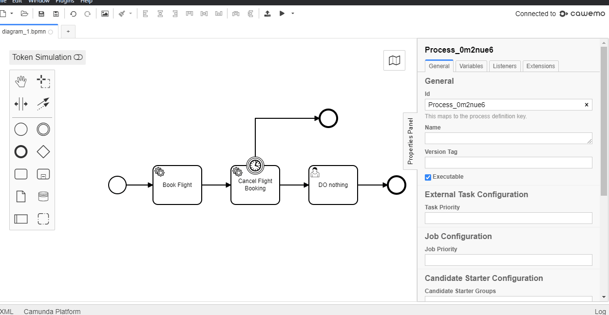

# Camunda Modeler Best Plugins List

This is a list of the plugins I like to use with the Camunda modeler when i'm building processes, If you've seen my modeler in a tutorial or a demo and i had something extra that looked fancy, it's probably on this list.

## Token Simulation
Want to see how your process might look if you ran it was executable? Well now you can. This wonderful plugin will show how tokens pass through the model as you've designed it!

https://github.com/bpmn-io/bpmn-js-token-simulation-plugin

## Technical Tool Tips
See the technical details of your process at a glance. Just scroll over the an interesting looking BPMN element and it suddenly becomes more interesting!  

https://github.com/viadee/camunda-modeler-tooltip-plugin

## BPMN Linting
How can you be sure that you've modeled to a standard by which you'd be able to brag to your friends and family about what a cool model you've made? Well you could give me a call and i'll tut at what you've made, but why not automate that process with this cool linting tool - with customizable rules!

https://github.com/camunda/camunda-modeler-linter-plugin

## Technical Property Info 
There are lots of different properties that you can add to BPMN symbols in Camunda and unfortunately it may not be obvious where they're all hiding. By using this plugin you'll be able to immediately where all of the addition properties are!

https://github.com/umb/camunda-modeler-property-info-plugin

